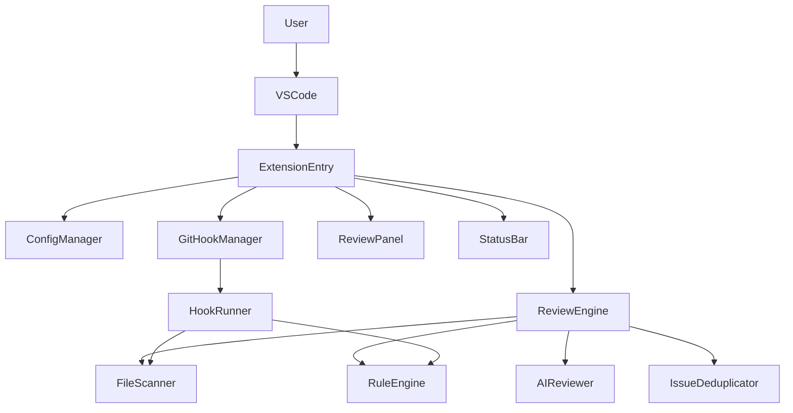

# 架构改进文档

## 目标
- 给出当前项目的架构说明与主要问题
- 提供高层级的结构优化方案与优先级
- 明确可维护性与可扩展性提升路径

## 当前架构概览
### 核心模块与职责
- 入口层 `src/extension.ts`
  - 插件激活、组件初始化、命令注册、业务编排
- 核心审查 `src/core/reviewEngine.ts`
  - 审查流程编排、规则与 AI 组合、结果聚合
- AI 审查 `src/core/aiReviewer.ts`
  - 请求构建、API 调用、响应解析、重试与缓存
- 配置管理 `src/config/configManager.ts`
  - YAML/ENV 读取、合并、监听、缓存
- Git Hook `src/hooks/gitHookManager.ts` + `src/hooks/hookRunner.ts`
  - hook 安装与执行、独立 Node 脚本运行
- UI 展示 `src/ui/reviewPanel.ts` + `src/ui/statusBar.ts`
  - TreeView 结果展示、状态栏提示与交互

### 数据流概览


## 主要结构性问题
- 入口层过重，业务编排与命令处理耦合在 `extension.ts`
- `ReviewEngine` 责任过多，流程编排与具体实现混杂
- `AIReviewer` 体量过大，包含请求/解析/重试/缓存多职责
- `ConfigManager` 混合加载、合并、监听、缓存
- `hookRunner` 复刻核心逻辑，易出现行为不一致
- 类型定义分散，难以统一演进

## 架构优化方案（高层）
### P0: 降低耦合与单点复杂度
1. 入口层瘦身
   - 拆分命令到 `src/commands/`，入口仅做初始化与注册
   - 收益: 入口职责清晰，扩展更稳
2. AI 审查拆分
   - 细分为 RequestBuilder / ResponseParser / RetryHandler
   - 收益: 解析与调用解耦，易定位问题
3. Hook 逻辑统一
   - 抽出纯 Node 核心能力供 hookRunner 复用
   - 收益: 避免重复实现，行为一致

### P1: 提升可维护性
4. 配置模块分层
   - Loader / EnvResolver / Merger / Watcher
   - 收益: 可测性强、职责清晰
5. ReviewEngine 只做编排
   - 分离规则、AI、AST、聚合逻辑到独立服务
   - 收益: 审查流程更清晰
6. 统一类型定义
   - 收敛到 `src/types/` 统一维护
   - 收益: 模型一致、依赖更明确

### P2: 长期演进
7. 统一错误处理
   - 规范错误类型与处理策略
8. 引入服务层
   - ReviewService / FileService 便于测试与替换

## 建议的目录形态（示意）
```
src/
  extension.ts
  commands/
    runReviewCommand.ts
    installHooksCommand.ts
    allowIssueIgnoreCommand.ts
  core/
    reviewEngine.ts
    ruleEngine.ts
    issueDeduplicator.ts
  ai/
    aiReviewer.ts
    aiRequestBuilder.ts
    aiResponseParser.ts
    aiRetryHandler.ts
  config/
    configManager.ts
    configLoader.ts
    configMerger.ts
  hooks/
    gitHookManager.ts
    hookRunner.ts
  ui/
    reviewPanel.ts
    statusBar.ts
  types/
    review.ts
    config.ts
    diff.ts
```

## 迁移顺序建议
1. 入口层拆分 + 类型集中
2. AI 审查拆分
3. ReviewEngine 分层 + Hook 逻辑统一
4. ConfigManager 分层

## 风险与注意事项
- HookRunner 必须保持无 VSCode API 依赖
- AI JSON 修复与重试策略需保持兼容
- ReviewEngine 拆分时需维持审查顺序与结果聚合规则
