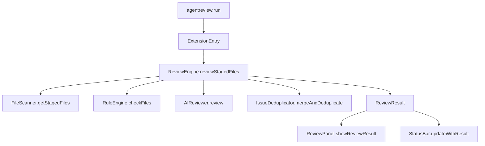
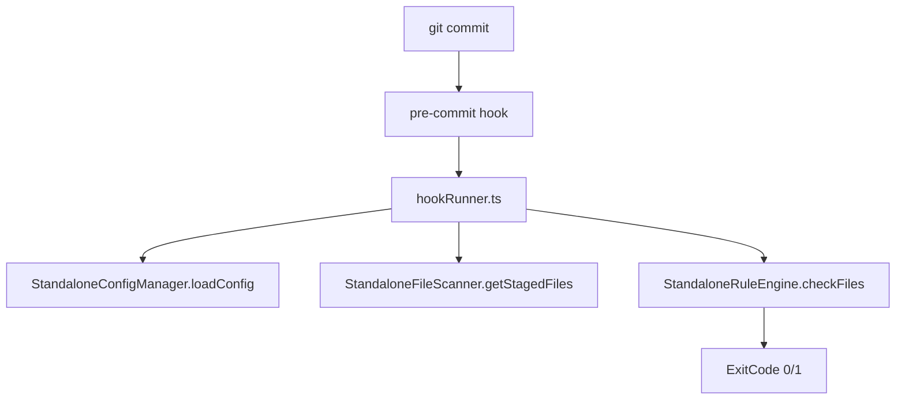
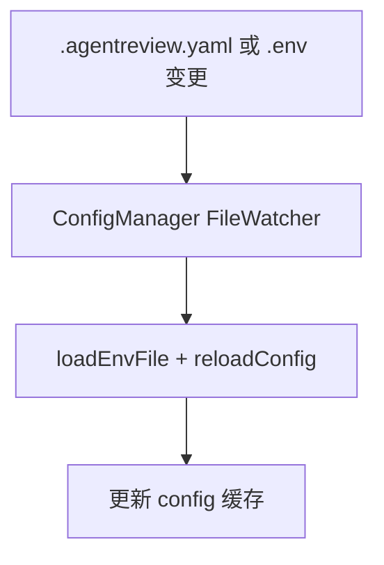

# 项目详细设计说明书

## 1. 项目目标与范围
- 目标: 提供 VSCode 内可触发的代码审查能力，并支持 Git pre-commit 阻断
- 范围: 规则检查、AI 审查、结果展示、配置管理、Hook 执行

## 2. 系统上下文
### 外部依赖
- VSCode API: 入口激活、命令注册、TreeView/StatusBar、文件监听
- Git: staged 文件与 pre-commit
- AI API: OpenAI 兼容或自定义接口

### 运行时形态
- 扩展进程内: 入口、配置、审查、UI
- Node 脚本: hookRunner 独立执行（无 VSCode 依赖）

## 3. 架构分层设计
### 入口层
**职责**
- 激活插件与初始化核心组件
- 注册命令，驱动审查与 UI 更新
- 根据配置自动安装 hook

**核心文件**
- `src/extension.ts`

### 核心审查层
**职责**
- 审查流程编排（规则 + AI + AST + 去重）
- 统一输出 ReviewResult

**核心文件**
- `src/core/reviewEngine.ts`
- `src/core/ruleEngine.ts`
- `src/core/issueDeduplicator.ts`

### AI 审查层
**职责**
- 组装请求、调用 API、解析响应
- 请求校验与 JSON 修复
- 重试与缓存

**核心文件**
- `src/core/aiReviewer.ts`

### 配置管理层
**职责**
- YAML/ENV 读取与合并
- 配置缓存与文件监听
- 对外提供配置读取接口

**核心文件**
- `src/config/configManager.ts`

### Hook 层
**职责**
- 安装/卸载 pre-commit hook
- hookRunner 独立执行规则检查

**核心文件**
- `src/hooks/gitHookManager.ts`
- `src/hooks/hookRunner.ts`

### UI 展示层
**职责**
- TreeView 展示结果
- StatusBar 展示状态与统计

**核心文件**
- `src/ui/reviewPanel.ts`
- `src/ui/statusBar.ts`

### 工具与基础能力
**职责**
- 文件扫描、diff 解析、AST 范围提取
- 日志输出

**核心文件**
- `src/utils/fileScanner.ts`
- `src/utils/diffParser.ts`
- `src/utils/astScope.ts`
- `src/utils/logger.ts`

## 4. 关键流程设计
### 4.1 VSCode 内手动审查流程

### 4.2 pre-commit Hook 审查流程

### 4.3 配置热更新流程

## 5. 关键数据模型
### ReviewIssue
- file: string
- line: number
- column: number
- message: string
- reason?: string
- rule: string
- severity: 'error' | 'warning' | 'info'
- astRange?: { startLine: number; endLine: number }

### ReviewResult
- passed: boolean
- errors: ReviewIssue[]
- warnings: ReviewIssue[]
- info: ReviewIssue[]

### AgentReviewConfig
- rules: 规则开关与 action
- ai_review: AI 配置与策略
- git_hooks: hook 安装与放行配置
- ast: AST 范围配置
- exclusions: 排除列表

## 6. 错误处理与日志
- 使用 `Logger` 统一输出调试与错误日志
- AI 调用失败使用重试策略并记录错误上下文
- 文件读写与配置解析失败时提供降级策略或默认配置

## 7. 性能与稳定性考虑
- diff_only: 仅审查变更行或变更片段
- AST 范围: 减少发送给 AI 的上下文
- 大文件阈值与二进制检测，避免 Hook 卡顿
- AI 批次处理与缓存，减少重复调用

## 8. 测试策略
- 单元测试覆盖核心模块与工具函数
- 重点覆盖: ReviewEngine、AIReviewer、ConfigManager、RuleEngine
- 测试目录: `src/__tests__/`

## 9. 兼容性与约束
- 需兼容 Windows 与 Unix hook 脚本
- hookRunner 必须无 VSCode API 依赖
- AI API 支持 OpenAI 兼容与自定义格式

## 10. 演进方向
- 入口层拆分与命令模块化
- AI 审查拆分为小模块
- 统一 HookRunner 与核心逻辑
- 类型集中与错误体系统一
