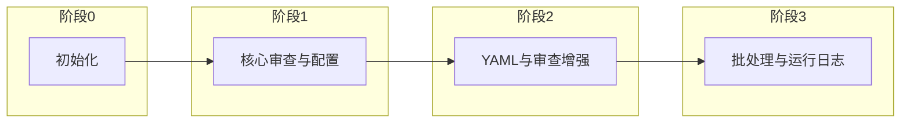

# AgentReview 功能迭代文档

本文档基于 git 提交记录整理，按阶段/功能分组，便于回溯版本与验收 Phase1 范围。可与 `.cursor/plans/design/phase1-mvp.md`、`phase2-enhance.md` 对照使用。

---

## 迭代总览



| 阶段 | 时间范围 | 核心主题 |
|------|----------|----------|
| 阶段 0 | 2026-01-21 | 插件基础框架 |
| 阶段 1 | 2026-01-24 ~ 2026-01-26 | 配置管理、审查引擎、Git Hook、修复与高亮 |
| 阶段 2 | 2026-02-08 | .agentreview.yaml、diff_only、AST 片段、放行此条（@ai-ignore） |
| 阶段 3 | 2026-02-10 ~ 2026-02-11 | 批处理/并发、运行日志解释与 human_readable |

---

## 阶段 0：初始化（2026-01-21）

**目标**：搭建插件骨架，具备扩展入口与基础命令。

| Commit | 概要 |
|--------|------|
| `c1417f3` | 初始提交：搭建 AgentReview 插件基础框架 |

**交付要点**：extension 激活与生命周期、基础命令与日志（对应 phase1-mvp「插件基础」）。

---

## 阶段 1：核心审查与配置（2026-01-24 ~ 2026-01-26）

**目标**：可配置的审查流程、Git Hook 阻断、结果展示与问题定位；曾支持修复能力后改为简化逻辑。

| Commit | 概要 |
|--------|------|
| `3428bf4` | 配置管理器、审查引擎、Git Hook 管理器；README 与关键文件注释 |
| `f718831` | AI 审查配置选项与环境变量；状态栏与日志；README 环境变量说明 |
| `b1f3bc5` | 大文件/二进制处理；测试脚本与 TS 配置；注释完善 |
| `9fa83cf` | 单问题修复、批量修复；配置管理器内置规则；审查引擎合并去重；高亮定位 |
| `ca47c6b` | 移除修复相关命令；简化问题处理逻辑；AGENTS.md 中文回复要求；测试覆盖 |

**交付要点**：配置管理、规则引擎（最小规则集）、GUI（TreeView + 状态）、高亮与问题定位、pre-commit 安装与阻断（对应 phase1-mvp「配置管理、规则引擎、GUI、Git Hook」）。修复入口曾存在，本阶段末移除。

---

## 阶段 2：YAML 配置与审查增强（2026-02-08）

**目标**：项目级 YAML 配置、仅审查变更行（diff_only）、AST 片段审查、放行此条（@ai-ignore）、架构文档与命令结构优化。

| Commit | 概要 |
|--------|------|
| `62cd97e` | `.agentreview.yaml` 配置；扩展目录加载；ConfigManager 环境变量与优先级 |
| `eb96a0f` | **diff_only** 增量审查；diffParser/diffTypes；AGENTS.md diff 说明 |
| `37564e5` | **AST 片段模式**；astScope、@babel/parser；ConfigManager/AIReviewer/ReviewEngine 支持 |
| `366262a` | Vue SFC 解析；@vue/compiler-sfc；astScope 单元测试 |
| `a86656b` | AST 预览模式配置；ConfigManager 逐项合并 AST 默认值 |
| `ebadf7e` | **放行此条（@ai-ignore）**；放行标记命令；ReviewEngine/ReviewPanel AST 与问题详情展示 |
| `5d6fac6` | 架构改进文档、详细设计说明书；extension 命令注册简化；AI 模块与配置管理器环境变量解析 |

**交付要点**：项目级 YAML、diff_only、AST 片段与 Vue SFC 支持、放行此条（@ai-ignore）入口、结果交互（AST 范围与问题详情）、架构与设计文档（对应 phase1-mvp「YAML 配置、结果交互优化、放行此条」）。

---

## 阶段 3：批处理与运行日志（2026-02-10 ~ 2026-02-11）

**目标**：AI 审查批处理与并发控制、运行日志解析与摘要、human_readable 配置。

| Commit | 概要 |
|--------|------|
| `58597f3` | AI 审查批处理配置与并发控制；AIReviewer/ConfigManager 更新 |
| `5fdf5dc` | 运行日志解释命令；runtimeLogExplainer、runtimeLogPath；extension 命令注册与目录解析 |
| `2ea385e` | 运行日志 `human_readable` 配置；ConfigManager、RuntimeTraceLogger 与测试更新 |

**交付要点**：批处理与并发配置、运行日志解释命令与目录解析、可读日志格式与测试（为 phase1 健壮性与可观测性补充）。

---

## 附录：Commit 速查表（时间倒序）

```
2ea385e 更新 .agentreview.yaml 以启用运行日志 human_readable；ConfigManager、RuntimeTraceLogger 与测试
5fdf5dc 运行日志解释命令；runtimeLogExplainer、runtimeLogPath；extension 注册与目录解析
58597f3 AI 审查批处理配置与并发控制；AIReviewer、ConfigManager
5d6fac6 架构改进文档与详细设计；extension 命令注册简化；AI 模块与环境变量解析
ebadf7e 放行此条（@ai-ignore）；放行标记命令；ReviewEngine/ReviewPanel AST 与问题详情
a86656b AST 预览模式配置；ConfigManager 逐项合并 AST
366262a Vue SFC 解析；@vue/compiler-sfc；astScope 单元测试
37564e5 AST 片段模式；astScope、@babel/parser；ConfigManager/AIReviewer/ReviewEngine
eb96a0f diff_only 增量审查；diffParser、diffTypes；AGENTS.md diff 说明
62cd97e .agentreview.yaml 配置；扩展目录加载；ConfigManager 环境变量与优先级
ca47c6b 移除修复命令；简化问题处理；AGENTS.md 中文回复；测试覆盖
9fa83cf 单问题/批量修复；内置规则；审查引擎合并去重；高亮定位
b1f3bc5 大文件/二进制处理；测试脚本与 TS 配置；注释完善
f718831 AI 审查配置与环境变量；状态栏与日志；README 环境变量说明
3428bf4 配置管理器、审查引擎、Git Hook 管理器；README 与注释
c1417f3 初始提交：搭建 AgentReview 插件基础框架
```

---

## 参考

- [Phase 1 MVP](.cursor/plans/design/phase1-mvp.md)
- [Phase 2 增强](.cursor/plans/design/phase2-enhance.md)
